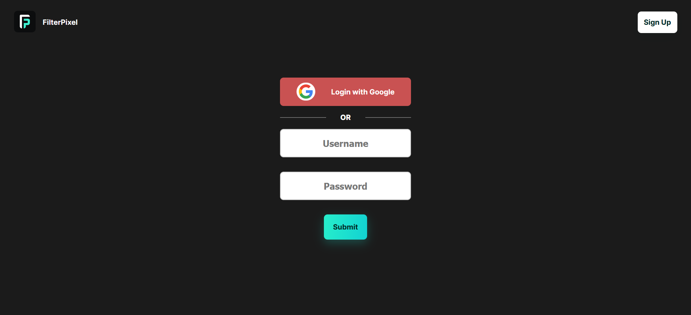
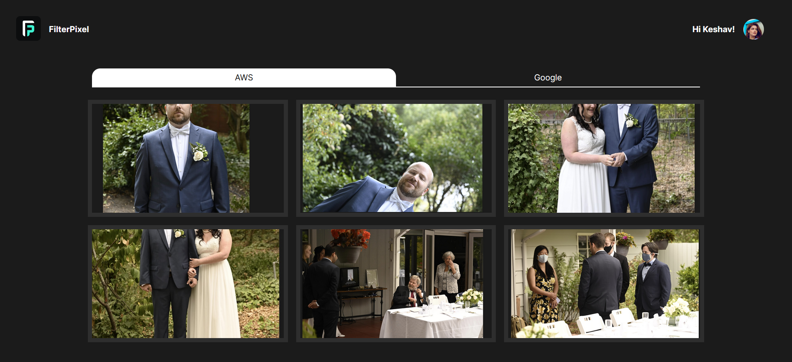

# Running FilterPixel with Flask (Backend) and React (Frontend)

To run a project that contains a Flask backend and a React frontend, you'll need to follow these steps:

## Step 1: Clone the Repository

1. Open your terminal or command prompt.
2. Navigate to the directory where you want to clone the repository using the `cd` command.
3. Clone the repository using `git clone`.

```bash
git clone https://github.com/K0DEL/FilterPixel
```

#### 4. Also download the credentials file from here and paste it in the backend folder (will be removed later). [Link](https://drive.google.com/file/d/1weOfqqGTHee83F2aVzLMooSsYYydsN1_/view?usp=sharing)

## Step 2: Set Up the Backend (Flask)

1. Navigate to the backend folder in the cloned repository.

```bash
cd FilterPixel/backend
```

2. Create a virtual environment (optional but recommended) to isolate project dependencies.

```bash
python -m venv venv
```

3. Activate the virtual environment.

- On Windows:

```bash
venv\Scripts\activate
```

- On macOS and Linux:

```bash
source venv/bin/activate
```

4. Install the backend dependencies using `pip`.

```bash
pip install -r requirements.txt
```

5. Start the Flask development server.

```bash
python main.py
```

The Flask backend will now be running on `127.0.0.1:5000`.

## Step 3: Set Up the Frontend (React)

1. Open a new terminal or command prompt window.

2. Navigate to the frontend folder in the cloned repository.

```bash
cd FilterPixel/frontend
```

3. Install the frontend dependencies using `npm` or `yarn`.

```bash
npm install
# or
yarn install
```

4. Start the React development server.

```bash
npm start
# or
yarn start
```

The React frontend will now be running on `http://localhost:3000`.

## Step 4: Accessing the Application

Now that both the Flask backend and React frontend are running, you can access the application in your web browser:

- Backend: Open `127.0.0.1:5000/` in your browser to see if the backend is running correctly. You might see a JSON response or a message confirming the backend's functionality.

- Frontend: Open `http://localhost:3000` in your browser to access the React frontend. The React app will communicate with the Flask backend on `127.0.0.1:5000/` for data and functionality.

## Additional Notes

- Ensure that your machine has Python and Node.js installed, as both Flask and React require them to work properly.

- Always refer to the project's documentation or README for any specific instructions or project dependencies.

## Here are some Application Screenshots:



